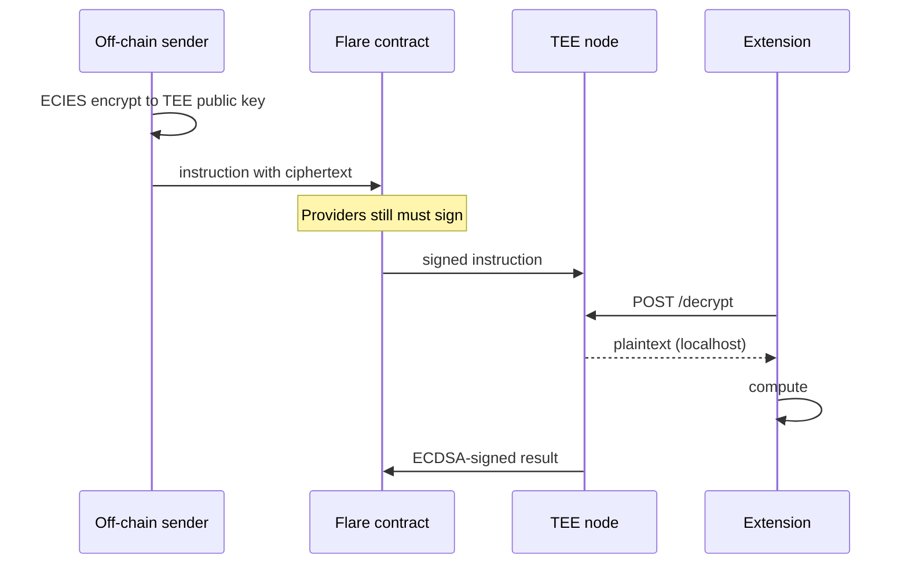

Each Trusted Execution Environment (TEE) machine generates an identity key pair at boot.
The public half is the TEE identity.
The private half stays inside the TEE enclave, and is never revealed to anyone.

That pair does three jobs:

- **Sign** results so anyone can check that this registered machine produced them.
- **Encrypt** secrets to the machine so only the enclave can open them.
- **Decrypt** payloads that were encrypted _to_ this machine's public key.

## Public Key vs Private Key

| Piece           | Who has it                                                                | What it does                                                             |
| --------------- | ------------------------------------------------------------------------- | ------------------------------------------------------------------------ |
| **Public key**  | Anyone. It can sit on-chain or be served from the proxy `/info` endpoint. | _Verify_ ECDSA signatures and _encrypt_ ECIES payloads to this TEE.      |
| **Private key** | Only the TEE, in the enclave.                                             | _Create_ ECDSA signatures and _decrypt_ ECIES payloads sent to this TEE. |

If the private key leaks, the identity is burned.
Anyone can forge signatures and read secrets meant for that machine.
The operator runs the box, but after boot nobody — including the operator — can extract the key from the enclave.

Flare Confidential Compute (FCC) default crypto matches Ethereum-style keys:

- **ECDSA on secp256k1** for signatures (same curve as Flare / Ethereum addresses).
- **ECIES** for encryption (encrypt with the public key, decrypt with the private key).

## ECDSA and ECIES

Both names are recipes for the same kind of key pair.
The **EC** is **elliptic curve**.
Flare and Ethereum use **secp256k1** — treat that as the Ethereum-compatible curve.

### ECDSA - the Stamp

[**ECDSA** (Elliptic Curve Digital Signature Algorithm)](https://en.wikipedia.org/wiki/Elliptic_Curve_Digital_Signature_Algorithm) proves origin.
It does not hide the message.

1. Hash the message (a short fingerprint of the bytes).
2. Mix that fingerprint with the **private key** to produce a signature (`r`, `s`, plus a recovery id on Ethereum-style chains).
3. Anyone with the **public key** (or the address derived from it) re-hashes the same bytes and checks the stamp.
   If one bit of the message changed, the check fails.

The text can be public.
The signature answers: _did this key produce these bytes, and were they altered?_

### ECIES - the Lockbox

[**ECIES** (Elliptic Curve Integrated Encryption Scheme)](https://en.wikipedia.org/wiki/Integrated_Encryption_Scheme) hides the message.

1. The sender uses the recipient's **public key** to wrap the payload with a one-time shared secret, a symmetric cipher, and an integrity check.
2. Only the matching **private key** can unwrap it inside the TEE.

Ciphertext is useless without the private key.
That is why FCC encrypts secrets _to_ the TEE's public key: the operator can copy the ciphertext, but only the enclave can open it.

| Name  | Job               | Everyday picture                |
| ----- | ----------------- | ------------------------------- |
| ECDSA | Sign / verify     | A wax seal on an open letter    |
| ECIES | Encrypt / decrypt | A locked box only one key opens |

**ECDSA proves origin. ECIES hides content.**

If you encrypt with the private key, the model is backward.
Private key signs and decrypts.
Public key verifies and encrypts.

## Outside vs Inside the Enclave

**Public by design.**
The TEE public key is the identity used for verification.
Anyone can also see the registered **code hash** of the Docker image, instruction events (unless the payload itself was encrypted), and signed results meant to be checked.
The **proxy** is the public front door.
The confidential Virtual Machine is not on the public internet.

**Private by design.**
The TEE private key never leaves the enclave.
Neither does any plaintext encrypted with that public key, nor do the secrets the extension holds in memory.
The node's crypto API (`POST /decrypt` on the sign port) is accessible only from localhost within the container.

## Decrypt Inside the TEE

A useful pattern is: **encrypt off-chain, decrypt only inside the TEE enclave**.

Explanation of the diagram:

1. Look up the target TEE's **public key** (for example from the proxy `/info` endpoint).
2. Encrypt the payload with **ECIES** to that key using the TEE's public key offchain.
3. Data providers still must [sign the instruction](/fcc/data-providers) with enough weight.
   Encryption does not skip consensus; it only hides bytes.
4. The extension does not hold the identity private key itself.
   It calls the TEE node locally (`POST /decrypt`) and asks the node to decrypt.
5. The node uses the enclave-held private key and returns plaintext.
6. The extension computes, then the TEE **signs** the result inside the enclave.
   Return a proof, a hash, or a signed transaction — not the original secret.

If the ciphertext was encrypted to a _different_ TEE's public key, decryption fails.
Keys are per identity, not a global FCC password.

:::tip[What's next]
Who is allowed to send the TEE work is a different stamp, covered next: [data providers and cosigners](/fcc/data-providers).

The [Private Key Extension](/fcc/guides/sign-extension) encrypts a key to the TEE with ECIES, decrypts it inside the enclave via `POST /decrypt`, then signs messages with ECDSA.
:::
