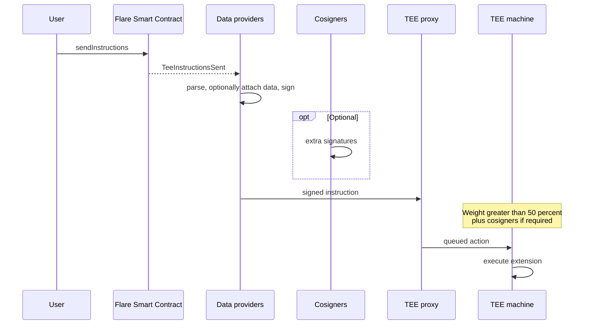

An onchain instruction does not run a Trusted Execution Environment (TEE) by itself.
[Data providers](/network/fsp) relay the event, optionally attach external data, and **sign** it.
The TEE executes only after those signatures reach a **threshold of signing weight**.
**Cosigners** can add a second authorization gate for sensitive work.

## Data Providers and Cosigners

The TEE machine sits behind a proxy.
Without a consensus check, anyone who can reach that proxy could feed it arbitrary work.

Flare Confidential Compute (FCC) reuses the [Flare Systems Protocol signing policy](/network/fsp): the same weighted data-provider set that backs FTSO and FDC.
Instructions are relayed to TEE machines only after reaching **more than 50%** signature weight.

That stamp is **permission, not privacy**.
Relayers can still see whatever you leave in plaintext.
Encrypt secrets _before_ they ride this path — see [TEE public and private keys](/fcc/tee-keys).

## Path Diagram

1. A user sends an instruction to a Flare Smart Contract.
2. A contract emits an instruction (`sendInstructions` on `TeeExtensionRegistry`): extension, operation, message, fee.
3. Data providers watch the event and parse it.
4. They sign under the **current signing policy**.
   Providers do not count equally — each carries **signing weight**.
5. Optional **cosigners** add signatures for payments, key administration, and similar operations.
6. The public **TEE proxy** receives the signed instruction and queues it.
7. The TEE pulls work, checks weight (and cosigners when required), then runs the compute extension.

## Signing Weight

Each data provider's signature is weighted by the current Flare Systems Protocol **signing policy**.
The TEE sums those weights.
It will not execute until the total is **greater than 50%** of the weight in that policy.
A proxy cannot authorize work on its own.
A sufficient number of the network has to agree that the instruction is real, which means more than 50% of the weight in the signing policy.

## Cosigners

Some jobs need a second gate.

| Role               | What the signature means                                                      |
| ------------------ | ----------------------------------------------------------------------------- |
| **Data providers** | The instruction is in policy and has enough network weight.                   |
| **Cosigners**      | This particular action is authorized (for example a payment or a key change). |

If either stamp is missing, the TEE does not run the instruction.

:::tip[Build next]

To continue building your understanding of the FCC protocol, see the following resources:

- read about the keys used in the FCC protocol, see [TEE public and private keys](/fcc/tee-keys);
- send instructions from a contract, start with [Build Your First Extension](/fcc/guides/getting-started);
- learn more about the signing policy, see [Weights and Signing](/network/fsp/weights-and-signing).
  :::
