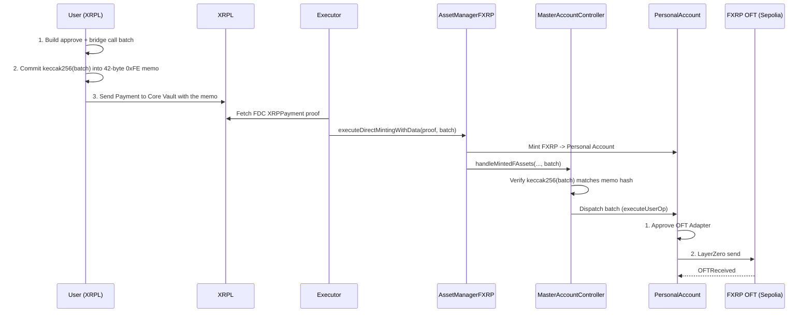

import CodeBlock from "@theme/CodeBlock";
import crossChainMint from "!!raw-loader!/examples/developer-hub-javascript/smart-accounts/cross-chain-mint.ts";

## Overview

In this guide, you will learn how to mint FXRP and bridge it cross-chain from Flare Testnet Coston2 to Sepolia using [Flare Smart Accounts](/smart-accounts/overview) and [LayerZero's OFT](https://docs.layerzero.network/v2/developers/evm/oft/quickstart) (Omnichain Fungible Token) protocol.

This guide demonstrates an end-to-end workflow that allows XRPL users to mint FXRP and bridge it to another EVM chain (Sepolia) **in a single XRPL payment**, through [FAssets direct minting](/fassets/minting).
The payment that mints the FXRP is the same payment that authorizes the approve-and-bridge call batch, via the [Custom Instruction](/smart-accounts/custom-instruction) (`0xFE`) protocol.

:::tip[Why direct minting through the Custom Instruction]
The XRPL memo commits to a `keccak256` hash of the approve-and-bridge call batch, and an off-chain executor delivers the actual bytes to Flare.
Because the memo size is fixed at 42 bytes, both calls fit in a single XRPL payment.
See the [Custom Instruction Comparison](/smart-accounts/custom-instruction-comparison) if you want to compare against the memo-field (`0xFF`) alternative, which trades the off-chain executor for a lower XRPL memo-size ceiling.
:::

**Key technologies:**

- [Flare Smart Accounts](/smart-accounts/overview) — Account abstraction enabling XRPL users to execute actions on Flare without holding FLR tokens.
- [Custom Instruction](/smart-accounts/custom-instruction) — Commits a call batch to a hash carried in the XRPL memo; an off-chain executor delivers the batch and finalizes the mint in one atomic Flare transaction.
- [FAssets minting](/fassets/minting) for tokenizing XRP to FXRP.
- [LayerZero OFT](https://docs.layerzero.network/v2/developers/evm/oft/quickstart) for cross-chain token transfers.

Clone the [Flare Viem Starter](https://github.com/flare-foundation/flare-viem-starter) to follow along with the script below.

## How Smart Accounts Enable This Workflow

[Flare Smart Accounts](/smart-accounts/overview) allow XRPL users to perform actions on the Flare chain without owning any FLR tokens.
Each XRPL address is assigned a unique **personal account** (smart contract wallet) on Flare, which only that XRPL address can control through `Payment` transactions on the XRP Ledger.

Minting and bridging are not two separate steps here - they happen **through the same direct-minting payment**:

1. The script builds a two-call batch: **approve** the OFT Adapter to spend the FXRP that is about to be minted, then **send** it to Sepolia via LayerZero.
2. It ABI-encodes that batch as a `PackedUserOperation` and commits to its `keccak256` hash in a 42-byte XRPL memo (see [Custom Instruction](/smart-accounts/custom-instruction)).
3. The user sends a single XRPL `Payment` to the FAssets [direct-minting address](/fassets/reference/IAssetManager#directmintingpaymentaddress) carrying that memo - this is the payment that mints the FXRP.
4. An executor fetches an [FDC `XRPPayment` proof](/fdc/attestation-types/xrp-payment) for that payment and calls [`executeDirectMintingWithData`](/fassets/reference/IAssetManager#executedirectmintingwithdata), handing over the full call batch bytes alongside the proof.
5. `AssetManagerFXRP` mints FXRP into the personal account and, in the same Flare transaction, the `MasterAccountController` verifies the hash and dispatches the approve-and-bridge batch on the personal account.

If the executor's call reverts for any reason, the entire Flare transaction rolls back: no FXRP is minted and no batch runs, so the mint and the bridge trigger can never diverge - see [Failure Handling](/smart-accounts/custom-instruction#failure-handling).
The underlying XRP is not lost in this case - it still sits at the Core Vault, and can be turned into plain FXRP (without running the approve-and-bridge batch) via the `0xE0` skip-memo flow, see [Recovery after a failed mint](/smart-accounts/custom-instruction#recovery-after-a-failed-mint).

## Flow Diagram



## Prerequisites

- **XRPL Testnet Account**: An XRP Ledger testnet wallet with XRP for payments.
  Get testnet XRP from the [XRP Testnet Faucet](https://xrpl.org/resources/dev-tools/xrp-faucets).
- **Flare Testnet Account**: An EVM wallet with C2FLR for gas fees, funded to the **personal account** address (not the externally owned account, or EOA) so the approve-and-bridge batch can pay the LayerZero fee.
  Get C2FLR from the [Flare Testnet Faucet](https://faucet.flare.network/coston2).
  The [State Lookup guide](/smart-accounts/guides/typescript-viem/state-lookup-ts#personal-account-of-an-xrpl-address) shows how to derive the personal account address from the XRPL address.
- **FDC Verifier API Key**: Required for the executor step.
  Register for one via the [FDC verifier documentation](/fdc/getting-started).
- **Environment Setup**: `flare-viem-starter` cloned, with `.env` configured (see [Configuration](#configuration)).

## Configuration

The script reads its parameters from the `CONFIG` object and environment variables:

```typescript
const CONFIG = {
  COSTON2_OFT_ADAPTER: "0xCd3d2127935Ae82Af54Fc31cCD9D3440dbF46639",
  SEPOLIA_FXRP_OFT: process.env.SEPOLIA_FXRP_OFT,
  SEPOLIA_EID: EndpointId.SEPOLIA_V2_TESTNET,
  EXECUTOR_GAS: 200_000,
};
```

| Parameter             | Description                                                   |
| --------------------- | ------------------------------------------------------------- |
| `COSTON2_OFT_ADAPTER` | Address of the FXRP OFT Adapter for LayerZero bridging        |
| `SEPOLIA_FXRP_OFT`    | Address of the FXRP OFT on Sepolia, used to watch for arrival |
| `SEPOLIA_EID`         | LayerZero Endpoint ID for the destination chain               |
| `EXECUTOR_GAS`        | Gas limit for the LayerZero executor on the destination chain |

The net XRP amount to mint and bridge is set locally in the script as `fxrpMintAmountXrp` (10 by default).

```bash
# .env file
XRPL_TESTNET_RPC_URL=wss://s.altnet.rippletest.net:51233
XRPL_SEED=your_xrpl_wallet_secret_here
PRIVATE_KEY=your_flare_private_key_here
SEPOLIA_RPC_URL=your_sepolia_rpc_url_here
SEPOLIA_FXRP_OFT=sepolia_fxrp_oft_address_here
VERIFIER_URL_TESTNET=https://fdc-verifiers-testnet.flare.network/
VERIFIER_API_KEY_TESTNET=your_fdc_verifier_api_key_here
```

## How to Run

```bash
pnpm run script src/layer-zero/cross-chain-mint.ts
```

## How It Works

The script reads the personal account, FXRP token, and gross XRP payment amount, quotes the LayerZero native fee, then builds a two-call batch (**approve** the OFT Adapter, then **send** to Sepolia).
It commits that batch's `keccak256` hash into a 42-byte XRPL memo and sends the XRPL payment - the same payment that mints the FXRP.
An executor then fetches an FDC proof and calls `executeDirectMintingWithData`, which mints the FXRP and dispatches the approve-and-bridge batch atomically in one Flare transaction, before the script polls Sepolia for the `OFTReceived` event to confirm arrival.

For the full line-by-line walkthrough - including how the LayerZero `SendParam` and refund address are built, and the `sendHashInstruction` / `executeDirectMintingWithData` / `findUserOperationExecuted` three-step protocol - see the [Cross-Chain Mint](/smart-accounts/guides/typescript-viem/cross-chain-mint-ts) guide, which walks through this exact script.

## Full Script

<details>
<summary>View `cross-chain-mint.ts` source code</summary>

<CodeBlock language="typescript" title="src/layer-zero/cross-chain-mint.ts">
  {crossChainMint}
</CodeBlock>

</details>

## Expected Output

```
Personal account: 0xFd2f0eb6b9fA4FE5bb1F7B26fEE3c647ed103d9F
FXRP token: 0x0b6A3645c240605887a5532109323A3E12273dc7
OFT Adapter (Coston2): 0xCd3d2127935Ae82Af54Fc31cCD9D3440dbF46639

Cross-chain mint details:
From (XRPL): rPdLcCkSJzLvURM2vV3bCWwXBgT7FyJojU
Via (Coston2 personal account): 0xFd2f0eb6b9fA4FE5bb1F7B26fEE3c647ed103d9F
To (Sepolia): 0xF5488132432118596fa13800B68df4C0fF25131d
Net FXRP to mint & bridge: 10 FXRP
XRPL payment amount (mint + fees): 10.2 XRP
LayerZero native fee: 22.950824887834713257 C2FLR
[mint-approve-and-bridge] customInstruction: [
  {
    target: '0x0b6A3645c240605887a5532109323A3E12273dc7',
    value: 0n,
    data: '0x095ea7b3000000000000000000000000cd3d2127935ae82af54fc31ccd9d3440dbf466390000000000000000000000000000000000000000000000000000000000989680'
  },
  {
    target: '0xCd3d2127935Ae82Af54Fc31cCD9D3440dbF46639',
    value: 22950824887834713257n,
    data: '0xc7c7f5b300000000000000000000000000000000000000000000000000000000000000800000000000000000000000000000000000000000000000013e81b5a305951ca90000000000000000000000000000000000000000000000000000000000000000000000000000000000000000fd2f0eb6b9fa4fe5bb1f7b26fee3c647ed103d9f0000000000000000000000000000000000000000000000000000000000009ce1000000000000000000000000F5488132432118596fa13800B68df4C0fF25131d0000000000000000000000000000000000000000000000000000000000989680000000000000000000000000000000000000000000000000000000000098968000000000000000000000000000000000000000000000000000000000000000e000000000000000000000000000000000000000000000000000000000000001200000000000000000000000000000000000000000000000000000000000000140000000000000000000000000000000000000000000000000000000000000001600030100110100000000000000000000000000030d400000000000000000000000000000000000000000000000000000000000000000000000000000000000000000000000000000000000000000000000000000000000000000000000000000'
  }
]

[mint-approve-and-bridge] current nonce: 194n

[mint-approve-and-bridge] userOpHash: 0xd5e696a799759b79bca768fa41a6e568424766fde45f2de62b72fecdd5b80a07
... (ABI-encoded _data omitted here; see the Cross-Chain Mint guide for the full transcript)

[mint-approve-and-bridge] total call.value (native value to attach on executor tx): 22950824887834713257n

[mint-approve-and-bridge] XRPL transaction hash: 5EF35694B74846271B21BF697BAF658F3FBC1FB6E9401CBAE4650B1C8D134C3E

[mint-approve-and-bridge] Waiting for XRPL transaction to reach 3 confirmations
[mint-approve-and-bridge] XRPL finality reached: 3 confirmations (txLedger=20096460, validated=20096462)
[mint-approve-and-bridge] Preparing FDC XRPPayment attestation for txid 0x5ef35694b74846271b21bf697baf658f3fbc1fb6e9401cbae4650b1c8d134c3e (proofOwner=0xF5488132432118596fa13800B68df4C0fF25131d)
... (FDC request/response logging omitted here)

FDC attestation submitted. Round id: 1432039
Waiting for FDC round to finalize...
Round finalized.

[mint-approve-and-bridge] FDC proof obtained (votingRound=1432039)
[mint-approve-and-bridge] Calling executeDirectMintingWithData on 0xc1Ca88b937d0b528842F95d5731ffB586f4fbDFA (value=22950824887834713257)
[mint-approve-and-bridge] executeDirectMintingWithData tx: 0x660816d1387a716824c9ba0ffeaf98d2f55ac43028754bff80e9c71f9e4cabbe
UserOperationExecuted: {
  eventName: 'UserOperationExecuted',
  args: {
    personalAccount: '0xFd2f0eb6b9fA4FE5bb1F7B26fEE3c647ed103d9F',
    nonce: 194n
  }
}

Track your cross-chain transaction:
https://testnet.layerzeroscan.com/tx/0x660816d1387a716824c9ba0ffeaf98d2f55ac43028754bff80e9c71f9e4cabbe

Waiting for FXRP to arrive on Sepolia (this can take a few minutes)...

FXRP arrived on Sepolia:
  Tx hash: 0xe5a614e4518ede743b1db69f10f618a4d593edc140a90fa687de724fbdf3f705
  Amount received: 10 FXRP
  Recipient: 0xF5488132432118596fa13800B68df4C0fF25131d
```

## Understanding the Instruction Encoding

The memo committed to the XRPL payment is a constant 42 bytes regardless of batch size, because the actual `target`/`value`/`data` of each call are delivered to the executor off-chain and only surface on Flare once `executeDirectMintingWithData` is called.
See the [Custom Instruction memo layout](/smart-accounts/custom-instruction#memo-layout) for the full byte-by-byte breakdown.

## FAQ

**Q: What's the minimum amount I can bridge?**
A: Direct minting has no fixed lot-size minimum; the script mints whatever `fxrpMintAmountXrp` you set (10 XRP by default).
The net amount just needs to cover the [minimum minting fee](/fassets/minting#fees) - if the payment is smaller than that, no FXRP is minted at all.

**Q: How long does the minting process take?**
A: The executor must wait for [XRPL finality](/fdc/attestation-types/xrp-payment#finality) before requesting the FDC proof, then submit `executeDirectMintingWithData`.
Rate limits may cause the mint to emit `DirectMintingDelayed` instead of executing synchronously - see [delayed minting](/fassets/minting#delayed-minting-flow) and [Step 3 troubleshooting](/smart-accounts/guides/typescript-viem/custom-instruction-ts#useroperationexecuted).

**Q: What if the mint or the bridge trigger fails?**
A: They cannot fail independently - `executeDirectMintingWithData` is fully atomic.
If it reverts, no FXRP is minted and the batch does not run; the underlying XRP remains at the [Core Vault](/fassets/core-vault) until recovered.
See [Failure Handling](/smart-accounts/custom-instruction#failure-handling) and [Recovery after a failed mint](/smart-accounts/custom-instruction#recovery-after-a-failed-mint).

**Q: Can I bridge to chains other than Sepolia?**
A: Yes, update the `SEPOLIA_EID` configuration to any LayerZero-supported destination.
Use the [getOftPeers script](/fxrp/oft/fxrp-autoredeem#discovering-available-bridge-routes) to discover available routes.

**Q: Do I need FLR tokens to use this?**
A: You need C2FLR (testnet FLR) funded to the **personal account** to cover the LayerZero fee that the bridge call attaches.
The mint and the bridge trigger are both driven by a single XRPL payment; you do not need FLR in your own externally owned account (EOA) for this flow.

**Q: What is the executor's role?**
A: The executor fetches the [FDC `XRPPayment` proof](/fdc/attestation-types/xrp-payment) for the user's XRPL payment and calls `executeDirectMintingWithData` on `AssetManagerFXRP`, supplying the approve-and-bridge batch bytes the user delivered off-chain.
This single call mints the FXRP and dispatches the batch atomically.
On mainnet, this role is intended to run as a separate service; this script plays both roles for demo purposes.

**Q: Can I use this on mainnet?**
A: This guide is for testnet.
For mainnet deployment, update contract addresses, thoroughly test, and audit all code.

## Troubleshooting

**Error: XRPL_SEED not set in .env**

- Solution: Add your XRPL testnet wallet secret to the `.env` file.

**Error: `executeDirectMintingWithData` reverted**

- Solution: Inspect the revert reason (`InvalidNonce`, `CustomInstructionHashMismatch`, `CallFailed`, and so on) - see [Common revert reasons](/smart-accounts/custom-instruction#common-revert-reasons).
  The entire transaction is atomic: no FXRP is minted and the batch does not run.

**Error: Insufficient XRP balance**

- Solution: Fund the XRPL wallet with enough XRP to cover the net mint amount plus fees, reported by `computeDirectMintingPaymentAmountXrp`.

**Error: LayerZero fee insufficient / `CallFailed` on the bridge call**

- Solution: Fund the **personal account** with more C2FLR so it can cover `nativeFee` when the batch executes.

**`UserOperationExecuted` not found in the receipt**

- Solution: Check whether `AssetManagerFXRP` emitted `DirectMintingDelayed` instead of completing synchronously; if so, wait for `executionAllowedAt` and resubmit `executeDirectMintingWithData` with the same proof - see [Rate Limits](/fassets/minting#rate-limits).

:::tip[Next Steps]
To continue your FAssets development journey, you can:

- Follow the [Cross-Chain Mint](/smart-accounts/guides/typescript-viem/cross-chain-mint-ts) guide for the full step-by-step walkthrough of this script.
- Read the [Custom Instruction](/smart-accounts/custom-instruction) reference for the full on-chain protocol.
- Learn how to [mint FXRP](/fassets/developer-guides/fassets-mint) on its own.
- Understand how to [redeem FXRP](/fassets/developer-guides/fassets-redeem).
- Explore [auto-redemption from Hyperliquid](/fxrp/oft/fxrp-autoredeem).
- Read more about [Flare Smart Accounts](/smart-accounts/overview).
  :::
