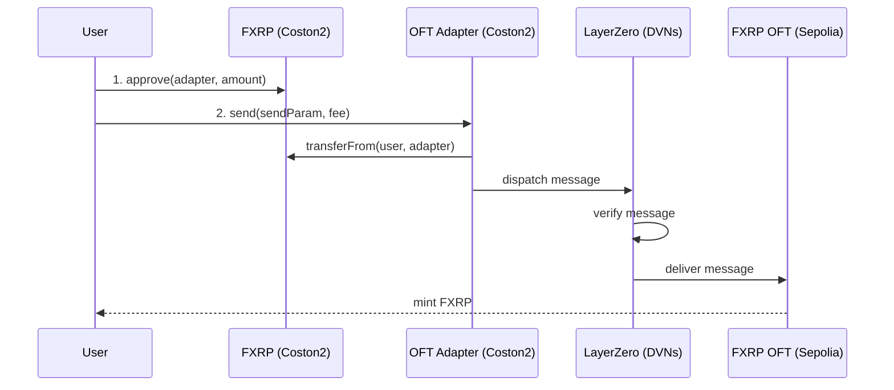

import CodeBlock from "@theme/CodeBlock";
import bridgeFxrp from "!!raw-loader!/examples/developer-hub-javascript/smart-accounts/bridge-fxrp.ts";

## Overview

In this guide, you will learn how to move FXRP you already hold on Flare Testnet Coston2 to Ethereum Sepolia using [Viem](https://viem.sh) and [LayerZero's OFT](https://docs.layerzero.network/v2/developers/evm/oft/quickstart) (Omnichain Fungible Token) standard.

FXRP is deployed as an OFT: on Flare, an **OFT Adapter** locks tokens when bridging out; on Ethereum, a native **OFT** contract mints the equivalent amount to the recipient.
See the [OFT overview](/fxrp/oft) for how the standard works and the full list of deployments.

**Key technologies:**

- [FAssets](/fassets/overview) — FXRP is the FAssets-wrapped representation of native XRP.
- [LayerZero OFT](https://docs.layerzero.network/v2/developers/evm/oft/quickstart) for cross-chain token transfers.
- [Viem](https://viem.sh) for reading from and writing to Flare and Ethereum.

The full code showcased in this guide, `bridge-fxrp.ts`, is available in the [`flare-viem-starter`](https://github.com/flare-foundation/flare-viem-starter/blob/main/src/layer-zero/bridge-fxrp.ts) repository under `src/layer-zero/bridge-fxrp.ts`.
Clone it to follow along:

```bash
git clone https://github.com/flare-foundation/flare-viem-starter
cd flare-viem-starter
pnpm install
```

## How Bridging Works

Moving FXRP from Flare to Ethereum is a two-step on-chain flow:

1. **Approve**: Grant the OFT Adapter permission to spend the FXRP you want to bridge.
2. **Send**: Call the OFT Adapter's `send()` function with the destination chain, recipient, and amount.
   The adapter pulls your FXRP via `transferFrom` (this is the lock) and instructs LayerZero to mint the equivalent amount to the recipient on Ethereum.



LayerZero's [DVNs](/fxrp/oft#dvn-security-stack) verify the message before it is delivered, so the transfer is asynchronous — it typically takes a few minutes to arrive.

## Prerequisites

- **Flare Testnet Account**: An EVM wallet with:
  - [FTestXRP (FXRP)](https://coston2-explorer.flare.network/address/0x0b6A3645c240605887a5532109323A3E12273dc7) on Coston2 to bridge.
  - C2FLR for gas and the LayerZero messaging fee.
- **Environment Setup**: A `.env` file with `PRIVATE_KEY` set to your Flare account's private key (see `.env.example` in the starter repository).

:::info[Need testnet tokens?]
You can get both FXRP and C2FLR from the [Coston2 Faucet](https://faucet.flare.network/coston2).
To mint FXRP yourself, follow the [Mint FXRP](/fassets/developer-guides/fassets-mint) guide.
:::

## Setup

The script reads and writes to Flare through a Viem public client and wallet client, both scoped to `flareTestnet`:

```typescript title="src/utils/client.ts"
import { createPublicClient, createWalletClient, http } from "viem";
import { privateKeyToAccount } from "viem/accounts";
import { flareTestnet } from "viem/chains";

export const publicClient = createPublicClient({
  chain: flareTestnet,
  transport: http(),
});

export const walletClient = createWalletClient({
  chain: flareTestnet,
  transport: http(),
});

export const account = privateKeyToAccount(
  process.env.PRIVATE_KEY as `0x${string}`,
);
```

The bridge parameters — the OFT Adapter address, the FAsset redeem composer, the destination LayerZero Endpoint ID, and the executor gas limit — are grouped in a `CONFIG` object at the top of the script:

```typescript title="src/layer-zero/bridge-fxrp.ts"
const CONFIG = {
  COSTON2_OFT_ADAPTER: "0xCd3d2127935Ae82Af54Fc31cCD9D3440dbF46639" as Address,
  COSTON2_COMPOSER: (process.env.COSTON2_COMPOSER ??
    "0xa10569DFb38FE7Be211aCe4E4A566Cea387023b0") as Address,
  SEPOLIA_EID: EndpointId.SEPOLIA_V2_TESTNET,
  EXECUTOR_GAS: 200_000,
} as const;
```

| Parameter             | Description                                                        |
| --------------------- | ------------------------------------------------------------------ |
| `COSTON2_OFT_ADAPTER` | Address of the FXRP OFT Adapter on Coston2                         |
| `COSTON2_COMPOSER`    | Address of the FAsset redeem composer on Coston2                   |
| `SEPOLIA_EID`         | LayerZero Endpoint ID for the destination chain (Ethereum Sepolia) |
| `EXECUTOR_GAS`        | Gas limit for the LayerZero executor on the destination chain      |

## Script Walkthrough

### Step 1: Resolve the Bridge Amount

The script reads the FXRP token address and decimals, then converts the human-readable `BRIDGE_AMOUNT` (defaulting to `"1"` FXRP) into token units with `parseUnits`:

```typescript title="src/layer-zero/bridge-fxrp.ts"
const bridgeAmount = process.env.BRIDGE_AMOUNT ?? "1";
const [fAssetAddress, decimals] = await Promise.all([
  getFxrpAddress(),
  getFxrpDecimals(),
]);
const amountToBridge = parseUnits(bridgeAmount, decimals);
```

### Step 2: Check Balance

Before bridging, the script confirms the signer holds enough FXRP:

```typescript title="src/layer-zero/bridge-fxrp.ts"
const balance = await getFxrpBalance(signerAddress);
if (balance < amountToBridge) {
  throw new Error("Insufficient FTestXRP balance");
}
```

### Step 3: Approve the OFT Adapter

The OFT Adapter needs an ERC-20 approval before it can lock your FXRP.
The script first confirms the adapter's underlying token matches the FXRP address it resolved, then approves the adapter and, if configured, the FAsset redeem composer:

```typescript title="src/layer-zero/bridge-fxrp.ts"
async function approveSpender(
  fAssetAddress: Address,
  spender: Address,
  amount: bigint,
) {
  const { request } = await publicClient.simulateContract({
    account,
    address: fAssetAddress,
    abi: erc20Abi,
    functionName: "approve",
    args: [spender, amount],
  });
  const txHash = await walletClient.writeContract(request);
  await publicClient.waitForTransactionReceipt({ hash: txHash });
}

async function approveTokens(
  fAssetAddress: Address,
  amountToBridge: bigint,
  decimals: number,
) {
  const underlyingToken = await publicClient.readContract({
    address: CONFIG.COSTON2_OFT_ADAPTER,
    abi: fxrpOftAbi,
    functionName: "token",
  });

  await approveSpender(
    fAssetAddress,
    CONFIG.COSTON2_OFT_ADAPTER,
    amountToBridge,
  );

  if (CONFIG.COSTON2_COMPOSER) {
    await approveSpender(
      fAssetAddress,
      CONFIG.COSTON2_COMPOSER,
      amountToBridge,
    );
  }
}
```

Composer approval is not needed for a plain transfer to your own address on Sepolia, but the script always grants it so the same approvals also cover the [auto-redeem to Hyperliquid](/fxrp/oft/fxrp-autoredeem) flow if you switch destinations later.

### Step 4: Build the Send Parameters

The recipient address is padded to 32 bytes, and `extraOptions` sets the gas the LayerZero executor should forward to `lzReceive` on the destination chain:

```typescript title="src/layer-zero/bridge-fxrp.ts"
function buildSendParam(recipient: Address, amountToBridge: bigint): SendParam {
  const options = Options.newOptions().addExecutorLzReceiveOption(
    CONFIG.EXECUTOR_GAS,
    0,
  );

  return {
    dstEid: CONFIG.SEPOLIA_EID,
    to: pad(recipient, { size: 32 }),
    amountLD: amountToBridge,
    minAmountLD: amountToBridge,
    extraOptions: options.toHex() as `0x${string}`,
    composeMsg: "0x",
    oftCmd: "0x",
  };
}
```

### Step 5: Quote the LayerZero Fee

The `quoteSend()` function returns the native fee (in C2FLR) required to pay for message delivery:

```typescript title="src/layer-zero/bridge-fxrp.ts"
async function quoteFee(sendParam: SendParam) {
  const { nativeFee } = await publicClient.readContract({
    address: CONFIG.COSTON2_OFT_ADAPTER,
    abi: fxrpOftAbi,
    functionName: "quoteSend",
    args: [sendParam, false],
  });
  return nativeFee;
}
```

### Step 6: Send

Finally, the script simulates and sends the `send()` transaction with the quoted fee attached as `value`:

```typescript title="src/layer-zero/bridge-fxrp.ts"
async function executeBridge(
  sendParam: SendParam,
  nativeFee: bigint,
  signerAddress: Address,
) {
  const { request } = await publicClient.simulateContract({
    account,
    address: CONFIG.COSTON2_OFT_ADAPTER,
    abi: fxrpOftAbi,
    functionName: "send",
    args: [sendParam, { nativeFee, lzTokenFee: 0n }, signerAddress],
    value: nativeFee,
  });

  const txHash = await walletClient.writeContract(request);
  await publicClient.waitForTransactionReceipt({ hash: txHash });
}
```

The adapter locks the FXRP on Coston2, and LayerZero delivers the equivalent amount to the recipient on Sepolia once the configured DVNs verify the message.

## How to Run

```bash
pnpm run script src/layer-zero/bridge-fxrp.ts
```

Set `BRIDGE_AMOUNT` in your environment to bridge a different amount of FXRP (e.g. `BRIDGE_AMOUNT=25`); it defaults to `1`.

## Expected Output

```
Using account: 0x742d35Cc6634C0532925a3b844Bc454e4438f44e
Token address: 0x...
Token decimals: 6

Bridge Details:
From: Coston2
To: Sepolia
Amount: 1.0 FXRP
Recipient: 0x742d35Cc6634C0532925a3b844Bc454e4438f44e

Your FTestXRP balance: 15.0

OFT Adapter underlying token: 0x...
Expected token: 0x...
Match: true

Approving FTestXRP for OFT Adapter: 0xCd3d2127935Ae82Af54Fc31cCD9D3440dbF46639
Amount: 1.0 FXRP
OFT Adapter approved

Approving FTestXRP for Composer: 0xa10569DFb38FE7Be211aCe4E4A566Cea387023b0
Composer approved
LayerZero Fee: 0.001234 C2FLR

Sending FXRP to Sepolia...
Transaction sent: 0xabc123...
Confirmed in block: 12345678

Track your transaction:
https://testnet.layerzeroscan.com/tx/0xabc123...

It may take a few minutes to arrive on Sepolia.
```

## Full Script

The repository with the above example is available on [GitHub](https://github.com/flare-foundation/flare-viem-starter).
In the example repository, helpers such as `getFxrpAddress` and `getFxrpBalance` are isolated into separate files in the `src/utils` directory.

<details>
<summary>View `bridge-fxrp.ts` source code</summary>

<CodeBlock language="typescript" title="src/layer-zero/bridge-fxrp.ts">
  {bridgeFxrp}
</CodeBlock>

</details>

:::tip[Next Steps]
To continue your FAssets development journey, you can:

- Learn how to [mint FXRP](/fassets/developer-guides/fassets-mint)
- Understand how to [redeem FXRP](/fassets/developer-guides/fassets-redeem)
- Explore [auto-redemption from Hyperliquid](/fxrp/oft/fxrp-autoredeem)
- Explore [auto-minting and bridging via Smart Accounts](/fxrp/oft/fxrp-automint) for XRPL-triggered workflows
  :::
